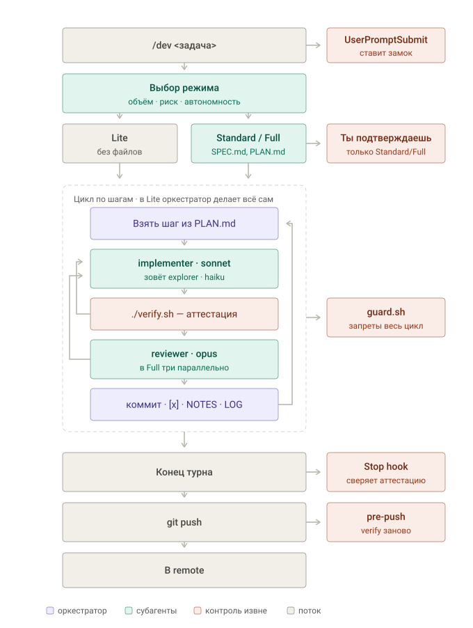

# cycle — цикл разработки для Claude Code

Превращает сессию с ассистентом в процесс, который переживает потерю контекста:
что делать — в SPEC.md, где мы — в PLAN.md/NOTES.md/LOG.md, сделано ли —
код выхода `./verify.sh`. Инструкции живут в скилле, запреты — в хуках,
потому что инструкцию модель может переосмыслить, а `exit 2` — нет.



Коралловым отмечено то, что выполняется **вне модели**: замок ставит хук по тексту
промпта, план подтверждаешь ты, `guard.sh` держит запреты весь цикл, Stop hook
сверяет аттестацию на выходе из турна, `pre-push` прогоняет проверку заново перед
отправкой в remote.

## Что внутри

```
cycle/
├── install.sh              ← установка скилла и агентов (один раз)
├── init-project.sh         ← подключение проекта (в каждом проекте)
├── test/test-kit.sh        ← 30 тестов на хуки; запускать после правок кита
├── global/                 → копируется в ~/.claude/
│   ├── skills/dev/SKILL.md   команда /dev: режимы Lite/Standard/Full
│   ├── skills/dev/full.md    детали Full (грузится только в Full)
│   └── agents/
│       ├── implementer.md    исполнитель — sonnet
│       ├── reviewer.md       ревьюер, только чтение — opus
│       └── explorer.md       поиск по коду — haiku
└── project/                → копируется в корень проекта
    ├── CLAUDE.md             короткий шаблон (≤60 строк)
    ├── verify.sh             единая проверка, выводит только ошибки
    ├── stats.sh              зеркало по LOG.md: где цикл буксует
    └── .claude/hooks/
    ├── git-hooks/pre-push    проверка перед отправкой в remote
    └── .claude/hooks/
        ├── verify-stop.sh    Stop hook: не даёт закончить с красным verify
        ├── dev-mode.sh       UserPromptSubmit: включает режим по /dev
        ├── fingerprint.sh    отпечаток исходников
        └── guard.sh          запреты: rm -rf, force-push, .env, тесты, замок
```

## Установка (один раз)

```bash
git clone https://github.com/virsis-bot/cycle.git ~/cycle
bash ~/cycle/install.sh
```

Ставит скилл `/dev` и трёх агентов в `~/.claude`. Существующие файлы с теми же
именами сохраняются как `*.bak.<дата>`. Обновление потом — `git pull` и тот же
`install.sh`.

## Подключение проекта

```bash
cd ~/projects/мой-проект
bash ~/cycle/init-project.sh
```

Затем:
1. Заполни `CLAUDE.md` (стек, команды, запреты).
2. В `verify.sh` раскомментируй строки под свой стек. **Пока не раскомментировано,
   `verify.sh` намеренно падает** — пустая проверка опаснее отсутствующей.
3. Если нет git: `git init && git add -A && git commit -m init`.
4. Перезапусти `claude` (хуки читаются при старте).

CLAUDE.md и verify.sh не перезаписываются. Изменённые хуки и settings.json
уходят в `*.bak.<дата>`, так что повторный запуск = безопасное обновление кита.

## Использование

```
/dev добавить выгрузку остатков Ozon в Google Sheets   ← Claude выберет режим сам
/dev lite поправить текст кнопки                         ← режим задан вручную
/dev full переписать синхронизацию заказов
```

- Lite — сразу делает, но план пишет в PLAN.md. Standard/Full — ждут «ок».
- Дальше работает Stop hook. Он отпускает, только когда `./verify.sh` зелёный
  **и** в PLAN.md нет незакрытых `- [ ]` (кроме помеченных `BLOCKED`).
- Замок `.claude/dev-mode` снимает сам хук. Агенту он недоступен — guard.sh
  блокирует и правку файла, и `rm` через shell, и `chmod -x verify.sh`.

Модель главной сессии (оркестратора): `/model opusplan` — Opus планирует,
Sonnet выполняет. Или `/model opus`, если бюджет позволяет.

## Что именно ловят хуки

| Хук | Ловит |
|---|---|
| guard.sh | `rm -rf` по цели вне проекта (включая `$HOME/...`, `..`, `/Users/...`) |
| guard.sh | `git push --force` (но `--force-with-lease` разрешён), `git reset --hard` |
| guard.sh | правку `.env` — и Edit/Write, и `> .env`, `sed -i`, `tee` |
| guard.sh | правку тестов при `.claude/protect-tests` — теми же двумя путями |
| guard.sh | снятие собственного замка: `.claude/dev-mode`, `chmod -x verify.sh` |
| verify-stop.sh | завершение при красном `verify.sh` — коммит проверку не отменяет |
| verify-stop.sh | завершение при незакрытых пунктах PLAN.md |
| pre-push | отправку в remote при красном `verify.sh` — проверка гоняется заново, а не по аттестации |
| guard.sh | `git push --no-verify` и запись в `.git/hooks/` — иначе pre-push снимается одной командой |

## Обучение

Отдельного механизма нет намеренно: файл «накопленных уроков» грузится в каждый
запрос, растёт всегда, а сигнал в нём затухает. Вместо него три канала:

| Что | Куда | Правило |
|---|---|---|
| Разовые грабли этого проекта | NOTES.md | одна-две строки на пункт |
| Повторяющееся и проверяемое | новый тест в `verify.sh` | знание в исполняемой форме, контекст не тратит |
| Повторяющееся и непроверяемое | ≤3 строки в CLAUDE.md | только если споткнулось **дважды** |

`./stats.sh` читает LOG.md и показывает, где буксует цикл: доля шагов, закрытых
с первой попытки, число возвратов, самый проблемный шаг, доля BLOCKED.
Много неудач на первой попытке — шаги слишком крупные. Растёт BLOCKED — дыра
в `verify.sh` или в дроблении плана.

## Как работает экономия

| Где | Что сделано |
|---|---|
| Скилл | `disable-model-invocation: true` — тело грузится только по `/dev` |
| Full | детали в `full.md`, читаются только в Full |
| Агенты | исполнитель sonnet, поиск haiku, ревью opus; отчёты ≤10–15 строк |
| Stop hook | не гоняет verify повторно, если состояние кода не менялось с зелёного |
| Stop hook | максимум 3 блокировки подряд, дальше сам пишет BLOCKED и отпускает |
| verify.sh | печатает только упавшие проверки, хвост 25 строк |
| CLAUDE.md | шаблон ≤60 строк |

## Управление вручную

| Действие | Команда |
|---|---|
| Снять замок досрочно | `rm .claude/dev-mode` (только вы, из терминала) |
| Разрешить правку тестов (Full) | `rm .claude/protect-tests` |
| Сбросить счётчик попыток | `rm .claude/.stop-attempts` |
| Заставить перепроверить всё | `rm .claude/.verify-green` |
| Отключить хуки в проекте | удалить блок `hooks` из `.claude/settings.json` |
| Поменять модель агента | поле `model:` в `~/.claude/agents/<имя>.md` |

## Удаление

```bash
rm -rf ~/.claude/skills/dev ~/.claude/agents/{implementer,reviewer,explorer}.md
```

В проекте: удалить `.claude/hooks/verify-stop.sh`, `guard.sh` и блок `hooks` в `.claude/settings.json`.

## Чего кит НЕ гарантирует

`guard.sh` — защита от случайностей и коротких путей, **не граница безопасности**.
Агент работает под тем же пользователем и с доступным shell, поэтому `eval`,
`sh -c`, склейка из переменных, симлинки и фоновые процессы фильтрации по строке
не поддаются в принципе. Поэтому кит устроен так, чтобы обход `guard.sh` ничего
не давал: Stop hook ничему на диске не верит, а сверяет отпечаток исходников,
посчитанный им самим без участия git, с тем, что записал последний `./verify.sh`.
Подменить проверку можно, только переписав `verify.sh` или хуки — а они входят
в тот же отпечаток, так что подмена видна.

Что остаётся открытым и закрывается только внешним прогоном (CI, в кит не входит):

- аттестация лежит в файле, а `guard.sh` не разбирает `sh -c` и `eval` — значит
  её можно подделать намеренной командой и завершить работу с красным кодом
  (на `git push` это вскроется: `pre-push` гоняет проверку заново);
- агент может обезвредить проверку, не трогая защищённых файлов: `conftest.py`,
  переменные окружения, подмена бинарника в PATH;
- `[x]` в PLAN.md можно проставить, не выполнив шаг.

Под одним пользователем с доступным shell неподделываемой локальной аттестации
не существует: секрет, которым её подписать, лежал бы там же, где её читают.
Поэтому кит честно рассчитан на добросовестного агента — он делает правильный
путь дешёвым, а обход требующим намеренных, заметных в истории действий.

## Требования
macOS/Linux, bash, git, python3 (есть в macOS вместе с Xcode Command Line Tools:
`xcode-select --install`).
